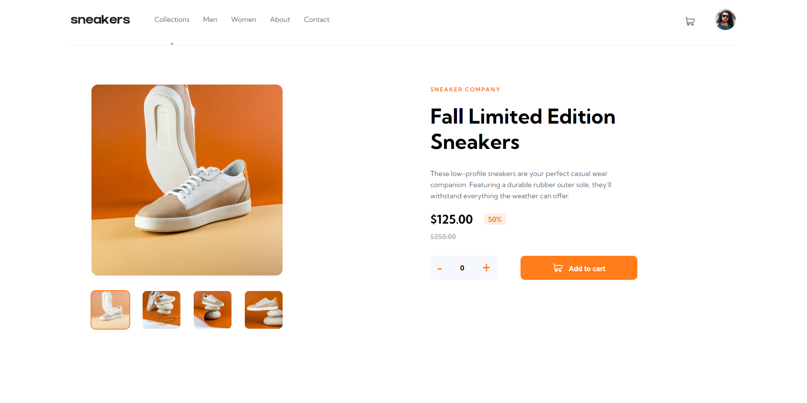
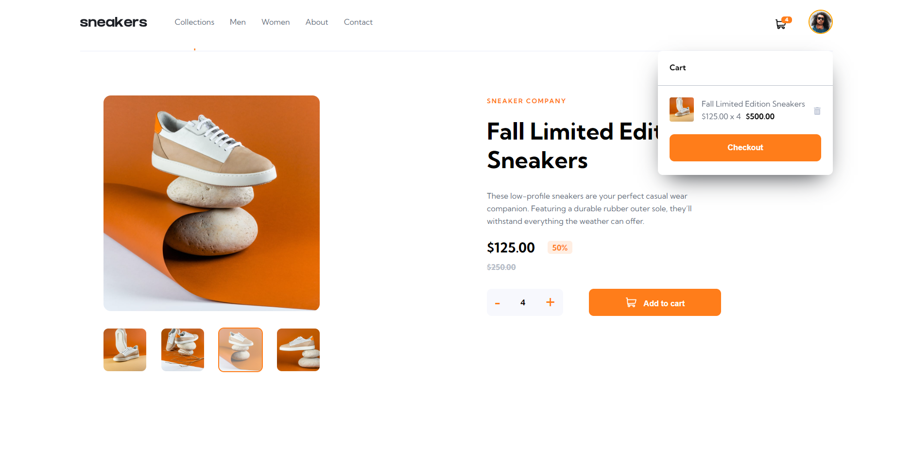
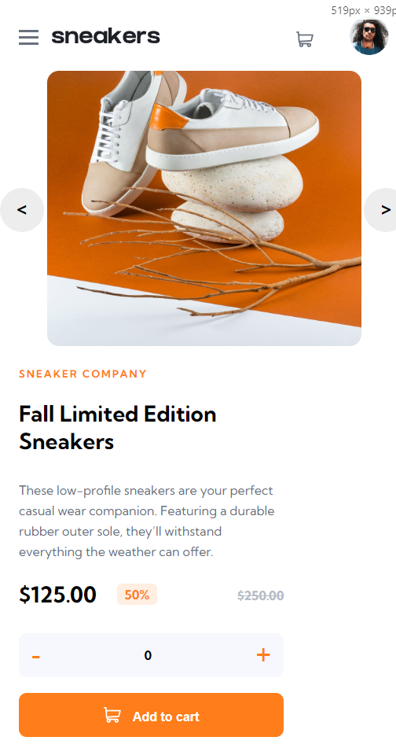
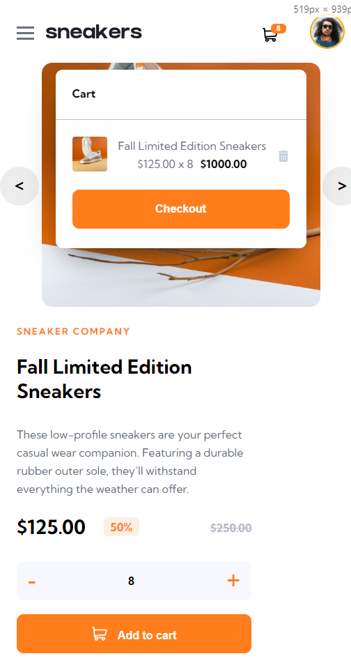

<h1 align="center">React Ecommerce👟🛒</h1>

<h4 align="center">
    This project is a challenge that I took from <a href="https://www.frontendmentor.io/challenges/ecommerce-product-page-UPsZ9MJp6">frontendmentor.io </a> which consists of building a responsible page of an online store.
</h4>

 

<h4 align = "center">
    <a align="center" href="https://www.frontendmentor.io/challenges/ecommerce-product-page-UPsZ9MJp6/hub">Front-end mentor challenge.</a> //
     <a align="center" href="https://gustavojuvino.github.io/Rest-Countries-Api/">Rest Countries Website App.</a>
</h4>

 

<h6 align="center"> This project was created with:</h6>
 

    
    
    

  

<!-- Desktop -->
<h2 align="center">Desktop Version 🖥️</h2>

<!-- Mobile -->
<h2 align="center">Mobile Version 📱</h2>

<!--Made By Gustavo J. Souza -->
